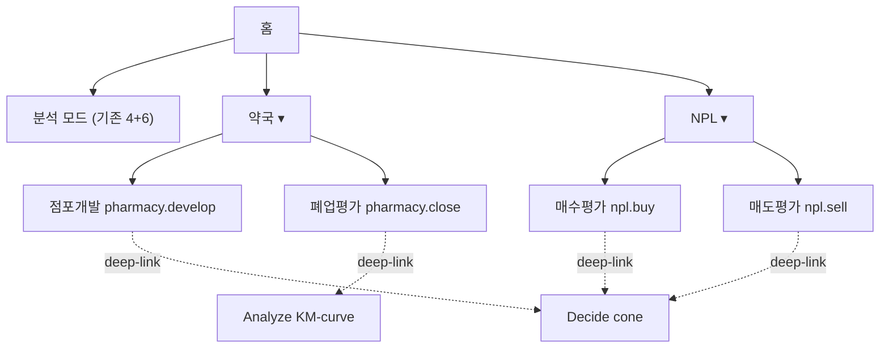

# Domain Menu IA — 약국 점포 / NPL 평가 카테고리

> **🎯 출시 wedge (2026-05-04 결정, ISS-090)**
> Wave 1 단독 출시: **`pharmacy.develop` (약국 점포개발 평가)** —
> 검증 사이클 7~10일 후 npl.buy → pharmacy.close → npl.sell 순차 클로닝.
> 근거: CEO 리뷰 ISS-070 (`docs/reviews/ceo-review-feature-domain-menu-001.md#d-wedge-권고`) + Eng 리뷰 ISS-071.
> 데이터 라이선스 미확정 도메인(NPL) 우선 검증 후 진행.

> **🔄 횡단 비교 보드 (Phase 2 IN, 결정 ISS-092)**
> 본 콘솔 차별화 코어 = "동일 메타포(pLDDT + cone)로 자산 횡단 비교".
> Wave 1 = pharmacy.develop 단독 출시 동안 **횡단 비교 보드는 OUT**, **Phase 2 IN으로 명시 확정**.
> Phase 2 진입 시 `?ctx=pharmacy.develop+npl.buy` 같은 다중 컨텍스트 URL 컨벤션 사용 (`+` 구분).
> URL 예시: `?mode=decide&ctx=pharmacy.develop+npl.buy&address=의정부시%20금오동` — 두 모델의 cone을 동일 차트에 오버레이.
> 근거: CEO 리뷰 D~E절 + Phase 2 차별화 핵심 자산. Wave 1 단독 wedge와 일관.

> 작성: product-manager (Harness FEATURE_DOMAIN_MENU-001)
> 일자: 2026-05-04
> 적용 브랜드 토큰: `.claude/brand-dna.json` (TowninAlpafold)
> 비파괴 원칙: 기존 4모드(Gallery / Explore / Analyze / Decide)와 6개 보조 모드(Workflow / DataStudio / Insights / Composer / Gallery2 / Decide2)는 그대로 유지. 본 IA는 **상단 글로벌 네비에 2개 카테고리만 추가**한다.

---

## A. IA (Information Architecture) 트리

### A.1 텍스트 트리

```
TowninAlpafold Console
├── [홈]
├── (분석 모드, 기존 비파괴)
│   ├── Gallery        — pLDDT 카드 그리드
│   ├── Explore        — 지도 + 레이어 토글
│   ├── Analyze        — 시계열 + 벤치마크
│   ├── Decide         — cone + 시나리오 + 추천 트레이스
│   ├── Workflow       — 6단계 PDCA 워크플로
│   ├── DataStudio     — 원시 데이터 검사
│   ├── Insights / Composer / Gallery2 / Decide2 (보조)
├── [약국 ▾]                       ← 신규 1급 카테고리
│   ├── 점포개발 (pharmacy.develop)
│   │   └── 입력 폼 → 적합도 결과 카드 → "Decide 모드로 cone 보기" deep-link
│   └── 폐업평가 (pharmacy.close)
│       └── 입력 폼 → Hazard 결과 카드 → "Analyze 모드로 KM curve 보기" deep-link
└── [NPL ▾]                        ← 신규 1급 카테고리
    ├── 매수평가 (npl.buy)
    │   └── 입력 폼 → 회수 cone + 3시나리오 → "Decide 모드로 비교" deep-link
    └── 매도평가 (npl.sell)
        └── 입력 폼 → NPV 비교 + 추천 트레이스 → "Decide 모드 추천 보기" deep-link
```

### A.2 Mermaid 다이어그램



### A.3 진입/탈출 관계

| 카테고리 화면 | 진입(어디서 옴) | 탈출(어디로 감) |
|---|---|---|
| 약국 점포개발 | 글로벌 네비 [약국 ▾] | "Decide 모드로 보기" → `decide?ctx=pharmacy.develop&address=...` |
| 약국 폐업평가 | 글로벌 네비 [약국 ▾] | "Analyze 모드 KM curve" → `analyze?ctx=pharmacy.close&store_id=...` + Benchmark 섹션 자동 스크롤 |
| NPL 매수평가 | 글로벌 네비 [NPL ▾] | "Decide 시나리오 비교" → `decide?ctx=npl.buy&address=...&scenarios=A,B,C` |
| NPL 매도평가 | 글로벌 네비 [NPL ▾] | "Decide 추천 트레이스" → `decide?ctx=npl.sell&portfolio_id=...` |

기존 4모드 측에서는 URL 쿼리 `ctx`가 있으면 상단 헤더에 "← 약국 점포개발 평가로 돌아가기" 형태의 복귀 링크가 노출된다. 복귀 링크는 신규 카테고리 컨텍스트 진입 시에만 표시(비파괴).

---

## B. 4개 평가모델 입력 스키마

공통 컨벤션:
- 좌표는 `lng`/`lat`(WGS84). 주소만 받은 경우 geocoding 후 동(`real_adm_cd`) 매칭.
- 시계열은 `simula_data_real.json`의 `meta.months` 인덱스(0=2020-01)와 동일 인덱싱.
- 신뢰도는 0~100 score + pLDDT 4단계 등급(`high≥90 / mid 70-89 / low 50-69 / poor<50`).

### B.1 pharmacy.develop — 입력

```json
{
  "$id": "pharmacy.develop.input.v1",
  "type": "object",
  "required": ["address"],
  "properties": {
    "address":          { "type": "string", "description": "후보 입지 주소" },
    "area_pyeong":      { "type": "number", "description": "평형 (선택)", "minimum": 5 },
    "rent_monthly_krw": { "type": "integer", "description": "임대료 월 (원, 선택)" },
    "operator_capital_krw": { "type": "integer", "description": "운영자 자본 (원, 선택)" },
    "expected_rx_per_day": { "type": "number", "description": "기대 처방건수/일 (선택, 미입력시 모델 추정)" }
  }
}
```

| 입력 필드 | 자동 계산 (geo 기반) | 외부 데이터 |
|---|---|---|
| `address` → `real_adm_cd` | population, visitors_total, biz_count, transit_score | (HIRA 의원 분포 / 약국 분포) |
| `area_pyeong` (옵션) | 면적 보정계수 | — |
| `expected_rx_per_day` (옵션) | 미입력 시 의원 분포·인구 기반 모델 추정 | (HIRA 처방 통계 OD) |

### B.2 pharmacy.close — 입력

```json
{
  "$id": "pharmacy.close.input.v1",
  "type": "object",
  "oneOf": [
    { "required": ["store_id"] },
    { "required": ["address"] }
  ],
  "properties": {
    "store_id":  { "type": "string", "description": "내부 점포 ID" },
    "address":   { "type": "string", "description": "주소(폴백)" },
    "operating_months": { "type": "integer", "description": "운영 개월", "minimum": 1 },
    "monthly_revenue_krw": {
      "type": "array", "items": { "type": "integer" },
      "description": "최근 12개월 매출 시계열 (필수, 최소 6개월)"
    },
    "monthly_rx_count": {
      "type": "array", "items": { "type": "integer" },
      "description": "최근 12개월 처방건수 시계열 (선택)"
    }
  }
}
```

| 입력 필드 | 자동 계산 | 외부 데이터 |
|---|---|---|
| `address`/`store_id` → 동 매칭 | 인구 변동률, biz_closed/biz_new, 경쟁약국 신규 진입 | (HIRA 약국 신규/폐업) |
| `monthly_revenue_krw` | 매출 추세(slope) + 변동성 | — |
| 동 단위 시계열 | KM 유사군 매칭 (`scenario` 동질군 기준) | 기존 `simula_data_real.json` |

### B.3 npl.buy — 입력

```json
{
  "$id": "npl.buy.input.v1",
  "type": "object",
  "required": ["address", "claim_amount_krw", "candidate_bid_krw"],
  "properties": {
    "address":          { "type": "string", "description": "담보 부동산 주소" },
    "asset_type":       { "type": "string", "enum": ["apt","officetel","house","commercial","land"] },
    "claim_amount_krw": { "type": "integer", "description": "청구액 (원)" },
    "candidate_bid_krw":{ "type": "integer", "description": "후보 매수가 (원)" },
    "rights": {
      "type": "object", "description": "권리관계",
      "properties": {
        "senior_lien_krw":  { "type": "integer", "description": "선순위 채권" },
        "tax_arrears_krw":  { "type": "integer", "description": "세금 체납" },
        "tenant_deposit_krw":{ "type": "integer", "description": "임차보증금" },
        "tenant_priority":  { "type": "string", "enum": ["small","priority","none"] }
      }
    }
  }
}
```

| 입력 필드 | 자동 계산 | 외부 데이터 |
|---|---|---|
| `address` → 동 매칭 | land_price (asset_type별), tx_volume, vacancy proxy | (KAB 실거래/공시지가 — 이미 동 단위 보유) |
| `rights.*` | 실회수금 = max(0, 낙찰가 추정 - senior - tax - tenant_priority_amt) | — |
| 동 시계열 24개월 | 회수기간 cone 추정 base | — |

### B.4 npl.sell — 입력

```json
{
  "$id": "npl.sell.input.v1",
  "type": "object",
  "oneOf": [
    { "required": ["portfolio_id"] },
    { "required": ["claim_id", "address", "claim_amount_krw"] }
  ],
  "properties": {
    "portfolio_id":     { "type": "string" },
    "claim_id":         { "type": "string" },
    "address":          { "type": "string" },
    "asset_type":       { "type": "string", "enum": ["apt","officetel","house","commercial","land"] },
    "claim_amount_krw": { "type": "integer" },
    "holding_months":   { "type": "integer", "description": "보유 개월" },
    "provision_rate":   { "type": "number", "description": "충당금률 (0~1)" },
    "carry_cost_monthly_krw": { "type": "integer", "description": "월 보유 비용 (원)" }
  }
}
```

| 입력 필드 | 자동 계산 | 외부 데이터 |
|---|---|---|
| 단건/포트폴리오 | 시장 비교 매물 호가 분포(p10/p50/p90) | (NPL 시장 매물 메타 — 신규 ETL) |
| `holding_months` 시나리오 | 6/12/24개월 회수 cone | 동 시계열 |
| `provision_rate`, `carry_cost` | 보유 NPV vs 즉시 매각 NPV | — |

### B.5 simula_data_real.json 키 매핑 표

| 평가모델 | 사용 layers 키 |
|---|---|
| pharmacy.develop | `visitors_total`, `visitors_20s..50plus`, `biz_count`, `biz_new`, `biz_closed`, `transit_score`, `walkability`, `subway_distance_m`, `bus_stop_density`, `base_population` |
| pharmacy.close | 위 + `biz_closed`(주변), `visitors_local`, `visitors_inflow`, 시계열 추세 (slope) |
| npl.buy | `land_price`, `land_price_apt`, `land_price_house`, `rent_price`, `tx_volume`, `tx_apt_count`, `tx_house_count` |
| npl.sell | npl.buy 동일 키 + 시계열 변동성(volatility) |

공통: 모든 모델은 동의 `plddt` 시계열(60개월)을 기반으로 출력 등급의 신뢰도를 산정한다.

---

## C. 4개 평가모델 출력 스키마

### C.1 공통 출력 컨벤션

```json
{
  "$id": "domain.eval.output.common.v1",
  "type": "object",
  "required": ["score","grade","top_drivers","cone","recommendation","trace"],
  "properties": {
    "score":   { "type": "number", "minimum": 0, "maximum": 100 },
    "grade":   { "type": "string", "enum": ["high","mid","low","poor"], "description": "pLDDT 4단계" },
    "top_drivers": {
      "type": "array",
      "items": {
        "type": "object",
        "required": ["feature","contribution","direction"],
        "properties": {
          "feature":      { "type": "string" },
          "contribution": { "type": "number", "description": "SHAP-style 기여도 (양/음)" },
          "direction":    { "type": "string", "enum": ["positive","negative"] }
        }
      },
      "minItems": 3, "maxItems": 5
    },
    "cone": {
      "type": "object",
      "required": ["p10","p50","p90"],
      "properties": {
        "p10": { "type": "number" },
        "p50": { "type": "number" },
        "p90": { "type": "number" },
        "horizon_months": { "type": "integer" }
      }
    },
    "recommendation": {
      "type": "object",
      "required": ["label","one_line"],
      "properties": {
        "label":    { "type": "string" },
        "one_line": { "type": "string" }
      }
    },
    "trace": {
      "type": "object",
      "description": "추천 trace (모델 버전·근거 데이터·생성 시각)",
      "properties": {
        "model_version":  { "type": "string" },
        "data_snapshot":  { "type": "string" },
        "generated_at":   { "type": "string", "format": "date-time" },
        "deep_link":      { "type": "string" }
      }
    }
  }
}
```

### C.2 모델별 추가 필드

| 모델 | 공통 + 추가 필드 |
|---|---|
| pharmacy.develop | `comparable_dongs[]` (유사 동 5개), `expected_rx_cone` (처방건수 cone) |
| pharmacy.close | `hazard_score` (0~100, 높을수록 위험), `km_curve` (생존곡선 series), `peer_dongs[]`, `recommendation.label ∈ {유지, 관찰, 철수}` |
| npl.buy | `expected_recovery_cone` (회수금 cone), `irr_estimate`, `scenarios[A,B,C]` (3옵션 비교), `top_risks[]` |
| npl.sell | `sell_now_npv`, `hold_npv_cone[6,12,24]`, `recommendation.label ∈ {즉시매각, 6개월보유, 12개월보유, 24개월보유}`, `drivers[]` |

---

## D. 기존 4모드와의 deep-link 매핑

| 모델 | 기본 deep-link | 재활용 자산 | URL 패턴 |
|---|---|---|---|
| pharmacy.develop | **Decide** (cone) | `UI_DECISION_ONEPAGER` 패턴 | `?mode=decide&ctx=pharmacy.develop&address=<addr>` |
| pharmacy.close   | **Analyze + Benchmark** (KM) | `UI_BENCHMARK_KM_CURVE-001` | `?mode=analyze&ctx=pharmacy.close&store_id=<id>&section=benchmark` |
| npl.buy          | **Decide** (cone + 3시나리오) | `UI_SCENARIOS_3OPTION-001` | `?mode=decide&ctx=npl.buy&address=<addr>&scenarios=A,B,C` |
| npl.sell         | **Decide** (recommendation trace) | `UI_RECOMMENDATION_TRACE-001` | `?mode=decide&ctx=npl.sell&portfolio_id=<id>&trace=on` |

deep-link 도착 시 동작:
1. URL 쿼리 `ctx`가 있으면 상단 헤더에 컨텍스트 배지 표시 (`pharmacy.develop · 입력 복귀 →`).
2. 해당 모드의 기본 시각화 위에 평가 결과 오버레이 (cone에 평가 점/cone 자체를 그대로 매핑).
3. "← 입력 화면으로 돌아가기" 링크 (페르소나 흐름 보존).

---

## E. 권한 / 페르소나

| 페르소나 | 접근 카테고리 | 핵심 사용 시나리오 |
|---|---|---|
| 약국 본사 개발담당자 | `pharmacy.develop` | 신규 입지 검토 / 후보지 3~5개 비교 |
| 약국 본사 운영·회계 담당자 | `pharmacy.close` | 분기별 점포 헬스체크 / 철수·관찰·유지 결정 |
| NPL 매수 심사역 | `npl.buy` | 매물 입찰가 결정 / 권리분석 시나리오 비교 |
| NPL 매도 담당자(보유자) | `npl.sell` | 보유 vs 매각 NPV 비교 / 매각 타이밍 |
| 분석 컨설턴트(겸직) | `pharmacy.* + npl.*` | 4개 모델 횡단 비교 / 공통 동 단위 분석 |

권한 정책: 본 IA는 권한 모델을 새로 만들지 않는다. 현 콘솔의 무권한 단일 사용자 모드를 유지하며, 카테고리 진입은 **메뉴 노출 + 컨텍스트 배지**로만 구분한다. (RBAC는 별도 이슈로 분리, 현재 범위 외)

---

## F. 데이터 소스 분리 / 공유 정책

| 카테고리 | 데이터 위치 | 소유 |
|---|---|---|
| **공유** | `simula_data_real.json` (인구/유동/상권/지가 — 동 단위 60개월) | 4개 모델 공통 참조 |
| 약국 전용 | `data_raw/pharmacy/` (HIRA 의원·약국 분포, 처방통계) — **신규 ETL 이슈로 분리** | `ETL_PHARMACY_DATA-001` |
| NPL 전용 | `data_raw/npl/` (권리분석 메타, NPL 시장 매물·호가) — **신규 ETL 이슈로 분리** | `ETL_NPL_DATA-001` |

원칙:
- 신규 카테고리는 즉시 `simula_data_real.json` 기반으로 동작 가능해야 한다 (ETL 미완성 시 도메인 전용 필드는 fallback 또는 mock).
- ETL 완성 전 → 도메인 전용 필드는 `recommendation.one_line`에 "외부 데이터 미적용 — 동 단위 통계만으로 추정" 워닝.
- ETL 완성 후 → 동일 응답 스키마, `trace.data_snapshot`만 갱신.

---

## G. UI 진입 동선 (와이어프레임 텍스트)

### G.1 글로벌 네비

```
┌───────────────────────────────────────────────────────────────────────────┐
│ TownAlpaFold  [홈] [Gallery] [Explore] [Analyze] [Decide] [Workflow]      │
│                                          [DataStudio]   [약국 ▾] [NPL ▾]  │
└───────────────────────────────────────────────────────────────────────────┘
```

`brand-dna.json` 토큰 적용:
- 활성 메뉴 — `colors.hero` (#00529B) underline 2px.
- hover — `motion.hover_effect: lift` + 0.15s `entrance_style: fade-in`.
- 폰트 — `typography.font_heading` (tight scale).
- 라운드 — `shape.radius: tight` (rounded-md).

### G.2 카테고리 드롭다운 (예: 약국)

```
[약국 ▾]
┌──────────────────────────┐
│ 점포개발                 │  ← persona: 개발담당자
│   신규 입지 적합도 평가  │
├──────────────────────────┤
│ 폐업평가                 │  ← persona: 운영/회계
│   운영 점포 생존성 진단  │
└──────────────────────────┘
```

### G.3 평가 화면 골격 (공통)

```
┌─ 헤더: [약국 ▾ > 점포개발] ─────── 데이터 스냅샷: 2026-04 ─┐
├─ [입력 폼] ─ 1열 (좌)         [결과 카드] ─ 2열 (우) ──────┤
│ 주소: [_______________]       SCORE  78 / 100  [mid]     │
│ 평형: [____]                  ━━━━━━━━━━━━━━━━━━━━━━━ │
│ 임대료: [____]                Top drivers (SHAP)         │
│                               + 인구 5만+ (+18)          │
│ ┌────────────────────────┐    + 의원 12개 반경 (+12)     │
│ │  평가 실행  (단일 CTA)  │    - 경쟁약국 4개 (-8)        │
│ └────────────────────────┘                              │
│                               [Decide 모드에서 cone 보기→]│
└──────────────────────────────────────────────────────────┘
```

CTA 정책 (`brand-dna.json`):
- 화면당 주요 CTA 1개 — "평가 실행" 또는 deep-link "Decide 모드에서 보기".
- pLDDT 색상 — 결과 등급 배지에 `plddt_high/mid/low/poor` 직접 매핑.
- anti_pattern 회피 — 단일 점추정만 표시 금지 → score 옆에 cone p10/p90 보조 라인 동시 표기.

### G.4 사용자 흐름 (페르소나 1턴)

```
[약국 ▾] 클릭
  → 점포개발 클릭
  → 입력 폼: 주소 입력 + 평가 실행 CTA
  → 결과 카드 (score / grade / top drivers / cone)
  → "Decide 모드에서 cone 보기" 클릭
  → /index.html?mode=decide&ctx=pharmacy.develop&address=...
  → Decide 화면 헤더에 ctx 배지 + 복귀 링크 자동 표시
  → 동일 동의 cone + 시나리오 보드 (기존 자산 그대로)
```

---

## H. 비파괴 / Surgical 보장

본 IA 적용 시 다음 파일은 **수정하지 않는다**:
- `app.js`, `index.html` (별도 USER_STORY가 컴포넌트 영역만 추가)
- 기존 4모드 컴포넌트
- `simula_data_real.json` (스키마 동일, 추가 ETL은 `data_raw/`로 격리)

수정 가능한 영역 (자식 USER_STORY에서 진행):
- `components/pharmacy-develop.js` (신규)
- `components/pharmacy-close.js` (신규)
- `components/npl-buy.js` (신규)
- `components/npl-sell.js` (신규)
- 글로벌 네비 슬롯 1곳 (드롭다운 2개 추가) — `index.html`에 "안전한 마운트 포인트"가 없으면 USER_STORY에서 별도 검토.

---

## I. 자가 검증 체크리스트 (UI 작업 완료 후)

- [ ] `brand-dna.json`의 `hero_color` (#00529B)를 평가 실행 CTA에 반영했는가?
- [ ] anti_patterns 5종 미위반 (단일 점추정 금지 / pLDDT 색상 임의 변경 금지 / 그라디언트·네온 금지 / 출처 없는 단정 금지 / 화면당 CTA 1개)
- [ ] `primary_action_per_screen: MUST_EXIST` — 4개 평가 화면 모두 단일 주요 CTA?
- [ ] `user_decision_clarity` — 결과 카드 진입 0.5초 안에 다음 행동(deep-link 버튼) 식별 가능?
- [ ] deep-link URL 패턴 4종이 기존 모드의 ctx 배지로 정상 수신되는가?

---

## J. 다음 사이클 자동 분기 (Harness)

| 자식 이슈 | 다음 단계 |
|---|---|
| `USER_STORY_PHARMACY_DEVELOP-001` | → `UX_DESIGN_PHARMACY_DEVELOP-001` (블로킹 풀린 후 ux-harness) |
| `USER_STORY_PHARMACY_CLOSE-001`   | → `UX_DESIGN_PHARMACY_CLOSE-001` |
| `USER_STORY_NPL_BUY-001`          | → `UX_DESIGN_NPL_BUY-001` |
| `USER_STORY_NPL_SELL-001`         | → `UX_DESIGN_NPL_SELL-001` |
| `ETL_PHARMACY_DATA-001`           | (병렬) HIRA 스키마 표준화 — 외부 출처 결정 별도 이슈 |
| `ETL_NPL_DATA-001`                | (병렬) NPL 시장 매물·호가 스키마 표준화 — 외부 출처 결정 별도 이슈 |

— 끝 —
