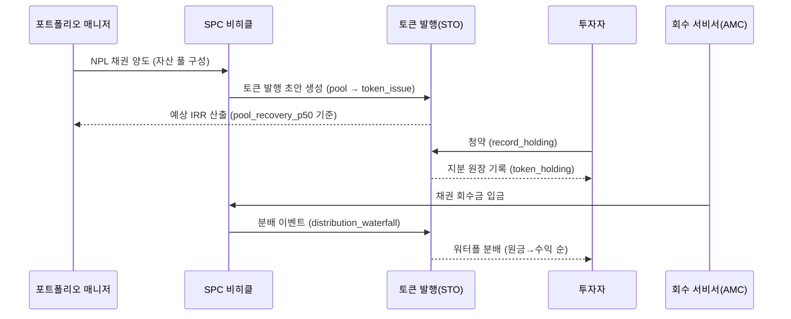

# NPL→RWA 토큰화 설계 — SPC 기초자산 → STO 발행 데이터모델

> 작성: 2026-06-24  
> 참조: §3 단계2, §4 RWA 토큰화 메커니즘 (NPL_RWA_사업계획서_260624.pdf)  
> 제도 근거: 2026.1.15 전자증권법·자본시장법 개정안 국회 본회의 통과  
> — 분산원장 = 법적 전자등록계좌부, STO = 제도권 증권, 투자계약증권 증권사 유통 허용

---

## 1. 전체 구조 흐름도

```
[1] 기초자산 확보         [2] SPC 설립·양도           [3] STO 발행
 ┌────────────────┐        ┌────────────────────┐       ┌──────────────────────┐
 │  NPL 채권 풀   │ ──양도→ │  SPC (유동화전문유) │ ──발행→│  토큰 (수익증권 등)   │
 │  npl_assets    │        │  spc_vehicle        │       │  token_issue         │
 │  (회수 cone)   │        │  - 채권관리 위탁    │       │  - 총발행량·단가     │
 └────────────────┘        │  - AMC 서비서       │       │  - 기초자산 매핑     │
                           └────────────────────┘       └──────────────────────┘
                                                                     │
[4] 투자자 유통                                      [5] 회수 분배
 ┌────────────────────┐       ┌─────────────────────────────────────┐
 │  token_holding      │       │  distribution_event (워터폴)         │
 │  - 조각 지분 원장   │ ←──── │  1단계: 원금 상환 (principal_repaid)  │
 │  - 투자자 ID        │       │  2단계: 수익 지급 (yield_paid)        │
 │  - qty (보유량)     │       │  3단계: 토큰 비율 배분               │
 └────────────────────┘       └─────────────────────────────────────┘
```

### Mermaid 흐름도



---

## 2. 데이터모델 — 4개 핵심 엔티티

### ① spc_vehicle — 유동화 비히클

| 컬럼 | 타입 | 설명 |
|------|------|------|
| id | TEXT PK | `SPC-xxxxxxxx` |
| name | TEXT | 법인명 (예: "알파폴드 1호 유동화전문(유)") |
| reg_number | TEXT | 법인등록번호 (**T2**: SPC 설립 완료 후 입력) |
| trust_type | TEXT | `spc`\|`trust` — SPC 설립 또는 신탁 구조 선택 |
| servicer | TEXT | 채권 회수 대리인 AMC명 |
| issuer_account_manager | TEXT | 발행인 계좌관리기관 (**T2**: 금융위 지정 필요) |
| status | TEXT | `draft`\|`active`\|`closed` |

**인덱스**: `idx_spc_status`

### ② token_issue — 토큰 발행

| 컬럼 | 타입 | 설명 |
|------|------|------|
| id | TEXT PK | `TKN-xxxxxxxx` |
| spc_id | TEXT FK | spc_vehicle 참조 |
| token_name | TEXT | 토큰 상품명 |
| security_type | TEXT | `revenue_share`(수익증권)\|`investment_contract`(투자계약증권) |
| total_tokens | INTEGER | 총 발행 토큰 수 |
| price_per_token | REAL | 1토큰당 발행가 (원) |
| min_subscription | INTEGER | 최소 청약 단위 (기본 1토큰) |
| pool_asset_ids | TEXT | JSON array — 기초자산 `npl_assets.id` 목록 |
| pool_total_claim | REAL | 기초자산 풀 채권합 (원) |
| pool_recovery_p50 | REAL | 풀 회수 중앙값 합산 (원) |
| pool_recovery_p10 | REAL | 풀 회수 하단 (원) |
| pool_recovery_p90 | REAL | 풀 회수 상단 (원) |
| expected_irr | REAL | 예상 IRR (소수) |
| issue_date | TEXT | 실제 발행일 (**T2**: 증권신고서 제출 후) |
| maturity_date | TEXT | 만기일 |
| status | TEXT | `draft`\|`open`\|`closed`\|`redeemed` |

**인덱스**: `idx_tki_spc`, `idx_tki_status`

### ③ token_holding — 투자자 지분 원장

| 컬럼 | 타입 | 설명 |
|------|------|------|
| id | TEXT PK | `HLD-xxxxxxxx` |
| issue_id | TEXT FK | token_issue 참조 |
| investor_id | TEXT | 투자자 식별자 (KYC 완료 후 DID 또는 내부 ID) |
| qty | INTEGER | 보유 토큰 수 (`CHECK qty > 0`) |
| purchase_price | REAL | 취득 단가 (원) |
| distributed_total | REAL | 누적 수취 분배금 (원) |
| subscribed_at | TEXT | 청약 일시 |

**인덱스**: `idx_hld_issue`, `idx_hld_investor`

### ④ distribution_event — 분배 이력

| 컬럼 | 타입 | 설명 |
|------|------|------|
| id | TEXT PK | `DST-xxxxxxxx` |
| issue_id | TEXT FK | token_issue 참조 |
| recovered_amount | REAL | 이번 회수금 (원) |
| principal_repaid | REAL | 원금 상환분 |
| yield_paid | REAL | 수익 지급분 |
| per_token_amount | REAL | 토큰 1개당 분배액 |
| distributed_at | TEXT | 분배 일시 |

**인덱스**: `idx_dst_issue`

### npl_assets 매핑 (기초자산 풀)

```
npl_assets.id  ──────────────────────────── token_issue.pool_asset_ids (JSON array)
npl_assets.recovery_p10/p50/p90 ──집계→──── token_issue.pool_recovery_p10/p50/p90
npl_assets.score_irr  ──────────────────── expected_irr 산출 참조 (풀 단위 재계산)
```

---

## 3. 조각화 모델 — 토큰 단가·지분·분배

### 발행 단가 산출 공식

```
total_issue_size = total_tokens × price_per_token

expected_irr = (pool_recovery_p50 − total_issue_size) / total_issue_size
```

- `pool_recovery_p50`: 기초자산 풀 회수 중앙값 합산 (npl_scorer 결과 캐시)
- `price_per_token`은 **발행자가 결정** — 기초자산 회수 cone을 보고 할인율 적용
- 예시: 채권 풀 100억, recovery_p50 = 130억, 발행 총액 = 100억 → expected_irr = 30%

### 조각화 최소 단위

| 항목 | 설명 |
|------|------|
| `min_subscription` | 1토큰 이상 (발행 설정, 기본 1) |
| `price_per_token` | 발행자 설정 (예: 10만 원 / 토큰) |
| 최소 투자금 | `min_subscription × price_per_token` (예: 10만 원) |

### 회수금 분배 워터폴

```
회수금 (recovered_amount)
    │
    ├─ [1단계] 원금 상환
    │         = min(recovered_amount, 미상환 원금)
    │         미상환 원금 = total_invested − 기누적분배금
    │
    └─ [2단계] 수익 지급
              = max(0, recovered_amount − 원금 상환분)
              → 토큰 보유 비율(qty / total_subscribed)로 분배

투자자 분배액 = recovered_amount × (qty_i / total_subscribed)
Sanity check: Σ 분배액 == recovered_amount (반올림 잔차는 첫 투자자 귀속)
```

---

## 4. STO 발행요건 체크리스트

> 📌 법무 자문 필요 항목은 **(법무자문)** 표기. 내부 시스템으로 처리 가능한 항목은 **(시스템)** 표기.

### 4-1. 발행인 요건

| # | 항목 | 분류 | 상태 |
|---|------|------|------|
| 1 | 유동화전문회사(SPC) 또는 신탁 설립 | **T2 (법무자문)** | 미완 |
| 2 | 자본시장법상 증권 발행인 요건 충족 | **(법무자문)** | 미완 |
| 3 | 발행인 계좌관리기관 등록 또는 제휴 | **T2 (금융위 심사)** | 미완 |
| 4 | 내부통제 기준 수립 | **(법무자문)** | 미완 |

### 4-2. 증권 유형 구분

| # | 항목 | 분류 | 상태 |
|---|------|------|------|
| 5 | 수익증권(`revenue_share`) vs 투자계약증권(`investment_contract`) 구분 확정 | **(법무자문)** | 미완 |
| 6 | NPL 회수권의 증권성 판단 (자본시장법 §4) | **(법무자문 필수)** | 미완 |
| 7 | 공모/사모 기준 확인 (50인 이상 → 공모 규제) | **(법무자문)** | 미완 |

### 4-3. 발행·유통 경로

| # | 항목 | 분류 | 상태 |
|---|------|------|------|
| 8 | 증권신고서 제출 (공모 시 금융위 심사) | **T2 (외부 자문)** | 미완 |
| 9 | 증권사 유통 채널 제휴 (2026.1.15 개정으로 허용) | **T2 (외부 자문)** | 미완 |
| 10 | 분산원장 선택 (프라이빗/퍼블릭) + 계좌관리기관 연동 | **T2 (기술+법무)** | 미완 |
| 11 | 토큰 발행·관리 스마트컨트랙트 배포 | **T2 (온체인, 범위 외)** | 미완 |

### 4-4. 투자자 보호

| # | 항목 | 분류 | 상태 |
|---|------|------|------|
| 12 | 투자자 위험고지 문서 작성 | **(법무자문)** | 미완 |
| 13 | 일반투자자 투자한도 설정 (자본시장법상 기준 적용) | **(법무자문)** | 미완 |
| 14 | KYC/AML 투자자 검증 시스템 | **T2 (외부 시스템 연동)** | 미완 |
| 15 | 청약 철회권 안내 | **(법무자문)** | 미완 |

### 4-5. 내부 시스템 (이번 구현 범위)

| # | 항목 | 분류 | 상태 |
|---|------|------|------|
| 16 | SPC 비히클 원장 (spc_vehicle 테이블) | **(시스템)** | ✅ 완료 |
| 17 | 토큰 발행 원장 (token_issue 테이블) | **(시스템)** | ✅ 완료 |
| 18 | 투자자 지분 원장 (token_holding 테이블) | **(시스템)** | ✅ 완료 |
| 19 | 분배 워터폴 계산 + 이력 (distribution_event 테이블) | **(시스템)** | ✅ 완료 |
| 20 | 기초자산 풀 집계 (npl_assets 회수 cone 합산) | **(시스템)** | ✅ 완료 |

---

## 5. T2 컨펌 필수 항목 (사용자 확인 + 외부 자문 필요)

> ⚠️ 아래 항목은 **내부 시스템만으로 처리 불가**. 실행 전 대표님 확인 + 외부 전문가 자문 필수.

```
┌─────────────────────────────────────────────────────────────────────────┐
│  T2 컨펌 항목 (EXTERNAL / SECURITY / DIRECTION 카테고리)                 │
├─────────────────────────────────────────────────────────────────────────┤
│  1. SPC 법인 설립                                                        │
│     → 법무법인 의뢰, 자본시장법 §188 유동화전문회사 요건 충족             │
│                                                                         │
│  2. 발행인 계좌관리기관 등록/제휴                                         │
│     → 금융위원회 심사, 지정 계좌관리기관(증권사 등)과 협약                │
│                                                                         │
│  3. 증권성 법무 판단 (NPL 회수권의 투자계약증권/수익증권 해당 여부)        │
│     → 법무법인에 의뢰, 자본시장법 §4 기준 판단                           │
│                                                                         │
│  4. 증권신고서 제출 (공모 50인 이상 시)                                   │
│     → 금융위 심사 (~45 영업일), 투자설명서 작성                           │
│                                                                         │
│  5. 증권사 유통 채널 계약 (토큰 거래 중개)                                │
│     → 2026.1.15 개정 허용, 개별 증권사와 협의                            │
│                                                                         │
│  6. KYC/AML 시스템 구축 또는 외부 서비스 연동                             │
│     → 특금법 의무, 전문 제공사(NICE평가정보 등) 계약                     │
│                                                                         │
│  7. 분산원장(블록체인) 선택 + 스마트컨트랙트 배포                         │
│     → 온체인 발행(Solidity 등) — 본 문서 범위 외, 기술 자문 필요         │
│                                                                         │
│  8. 투자자 보호 문서 + 위험고지 최종 확정                                 │
│     → 법무자문 + 금융감독원 기준 충족                                    │
└─────────────────────────────────────────────────────────────────────────┘
```

---

## 6. API 엔드포인트 요약

| Method | Path | 설명 |
|--------|------|------|
| POST | `/api/v1/rwa/spc` | SPC 비히클 생성 |
| POST | `/api/v1/rwa/issues` | 토큰 발행 생성 (기초자산 풀 집계 포함) |
| GET | `/api/v1/rwa/issues/{issue_id}` | 발행 상세 + 청약 현황 조회 |
| POST | `/api/v1/rwa/issues/{issue_id}/holdings` | 청약/지분 원장 기록 |
| POST | `/api/v1/rwa/issues/{issue_id}/distributions` | 분배 워터폴 실행 |

---

## 7. 후속 단계 (PARKED)

| 단계 | 내용 | 전제 조건 |
|------|------|-----------|
| V2 | 증권신고서 초안 자동 생성 (발행 원장 → 법정 서식) | T2 법무 자문 완료 |
| V3 | KYC/AML 연동 (투자자 검증 → investor_id DID 전환) | T2 외부 시스템 제휴 |
| V4 | 온체인 연동 (발행 원장 → 스마트컨트랙트 동기화) | T2 분산원장 선택 완료 |
| V5 | 이차 유통 지원 (token_holding 양도 — 증권사 ATS 연동) | T2 유통 채널 계약 완료 |
