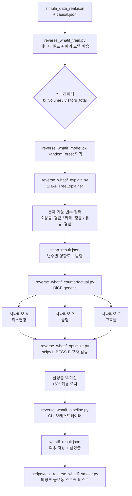

# Reverse What-if 엔진 마스터 플랜

**이슈:** ISS-191  
**작성:** plan-harness:product 모드  
**날짜:** 2026-05-11  
**상태:** APPROVED (USER_STORY 분해 완료)

---

## 1. 문제 정의

기존 `decision_tree_train.py`는 **분류기** — 주어진 지표 조합이 어떤 vibe_label인지 예측한다.  
하지만 실제 의사결정자(소상공인, 구청 담당자)가 묻는 질문은 다르다:

> "거래량(tx_volume)을 20% 올리려면 카페 수와 유동인구를 얼마나 바꿔야 하는가?"

이것이 **처방형(Prescriptive) 역산 문제**다.  
분류 → 회귀 전환 + Counterfactual Explanation + 수치 최적화 3단계로 답한다.

### 전제 조건
- `decision_tree_train.py` 는 **변경하지 않는다** (분류 파이프라인 독립 유지)
- 신규 파일은 모두 프로젝트 루트에 위치 (`reverse_whatif_*.py`)
- Y는 파라미터화 — `--target tx_volume` 또는 `--target visitors_total`

---

## 2. Y/X 변수표

### Y (회귀 대상, 연속형)

| 우선순위 | 변수명 | 원본 레이어 | 단위 |
|---|---|---|---|
| 1순위 | `tx_volume` | `simula_data_real.json → dongs[동코드].tx_volume` | 건/월 |
| 2순위 | `visitors_total` | `simula_data_real.json → dongs[동코드].visitors_total` | 명/월 |

### X (입력 특성, 11개)

| 특성명 | 원본 레이어 | 통제 가능 | 비고 |
|---|---|---|---|
| `소상공_평균` | `biz_count` 60개월 평균 | **가능** | 입지 시 조정 가능 |
| `소상공_추세` | `biz_count` 최근 12개월 slope | 불가 | 구조적 흐름 |
| `카페_평균` | `biz_cafe` 60개월 평균 | **가능** | 입지 시 조정 가능 |
| `카페_추세` | `biz_cafe` 최근 12개월 slope | 불가 | 구조적 흐름 |
| `유동_평균` | `visitors_total` 60개월 평균 | **가능** | 마케팅/이벤트 조정 가능 |
| `유동_추세` | `visitors_total` 최근 12개월 slope | 불가 | 구조적 흐름 |
| `거래_평균` | `tx_volume` 60개월 평균 | 불가 | Y 관련 참고 |
| `거래_추세` | `tx_volume` 최근 12개월 slope | 불가 | Y 관련 참고 |
| `지가_평균` | `land_price` 60개월 평균 | **불가** | 시장 결정 |
| `지가_추세` | `land_price` 최근 12개월 slope | 불가 | 시장 결정 |
| `인과_lag평균` | `causal.json` Granger lag 평균 | **불가** | 인과 지연 참고 |

**통제 가능 (DiCE/scipy 조정 대상):** `소상공_평균`, `카페_평균`, `유동_평균`  
**통제 불가 (SHAP 분석 후 자동 제외):** `지가_평균`, `인과_lag평균` (+ 모든 추세 변수)

---

## 3. 3단계 파이프라인 다이어그램



---

## 4. 파일 구조 (신규 파일)

```
프로젝트 루트/
├── reverse_whatif_train.py          # ISS-192: 데이터 빌드 + 회귀 모델 학습
├── reverse_whatif_explain.py        # ISS-193: SHAP 분석 + 통제 가능 필터
├── reverse_whatif_counterfactual.py # ISS-194: DiCE 3시나리오 생성
├── reverse_whatif_optimize.py       # ISS-195: scipy 교차 검증 + 달성률
├── reverse_whatif_pipeline.py       # ISS-196: CLI 오케스트레이터
├── scripts/
│   └── test_reverse_whatif_smoke.py # ISS-196: 스모크 테스트 (금오동)
└── docs/
    └── methods/
        └── reverse-whatif.md        # 방법론 문서 (ISS-196 포함)
```

**기존 파일 (변경 금지):**
- `decision_tree_train.py` — 분류기, 독립 유지
- `simula_data_real.json` — 읽기 전용 소스
- `causal.json` — 읽기 전용 소스

---

## 5. 검증 시나리오 — 의정부 금오동 Wedge

의정부시 금오동은 Phase 1.5 LocalData wedge 동으로 실데이터가 가장 많이 정비된 동이다.

### 스모크 시나리오

```
입력:
  동코드: 의정부 금오동 (dong_code 검색)
  Y: tx_volume
  목표 달성률: 현재 대비 +15%

기대 출력:
  시나리오 A (최소변경):
    - 조정 변수 1~2개
    - 달성률: 10~20% 범위
  시나리오 B (균형):
    - 조정 변수 2~3개
    - 달성률: 12~18% 범위
  시나리오 C (고효율):
    - 조정 변수 모두 활용
    - 달성률: 15% 이상

검증 기준:
  - DiCE vs scipy 달성률 차이 ±5% 이내
  - 처리 시간 < 30초 (genetic 수렴 포함)
  - whatif_result.json 정상 생성
```

---

## 6. 리스크 & 완화

| 리스크 | 수준 | 완화 방안 |
|---|---|---|
| Python 3.14.4 — SHAP 0.51.0 호환 미확인 | MEDIUM | ISS-192에서 import 검증 + fallback (SHAP 0.46.x) |
| DiCE genetic 수렴 시간 (데이터 규모에 따라 60초+) | MEDIUM | `n_cf=3`, `max_iter=500` 제한 + 타임아웃 30s 가드 |
| 통제 불가 변수를 사용자가 포함 요청 시 | LOW | SHAP 단계에서 명시적 `features_to_vary` 제한 + 경고 메시지 |
| Y=tx_volume vs Y=visitors_total 모델 정확도 차이 | LOW | 각각 별도 모델 저장 (`model_tx.pkl`, `model_vis.pkl`) |
| 데이터 불균형 (130개 동 × 60개월) | LOW | StandardScaler 정규화 후 학습. 부족 시 `min_samples_leaf=3` |
| simula_data_real.json 일부 동 NaN/0 값 | LOW | ISS-192 데이터 빌드 단계에서 `dropna` + 0값 필터 |

---

## 7. USER_STORY 목록 (ISS-192 ~ ISS-197)

| ID | 제목 | 담당 | 선행 |
|---|---|---|---|
| ISS-192 | 데이터 빌드 + 회귀 모델 학습 | plan-harness:code | — |
| ISS-193 | SHAP 분석 + 통제 가능 필터 | plan-harness:code | ISS-192 |
| ISS-194 | DiCE 3시나리오 생성 | plan-harness:code | ISS-193 |
| ISS-195 | scipy L-BFGS-B 교차 검증 + 달성률 | plan-harness:code | ISS-194 |
| ISS-196 | CLI 오케스트레이터 + 스모크 테스트 | plan-harness:code | ISS-195 |
| ISS-197 | CEO 전략 검토 (PLAN_CEO_REVIEW) | plan-ceo-reviewer | ISS-196 |
| ISS-198 | Eng Lead 실행 가능성 검토 (PLAN_ENG_REVIEW) | plan-eng-reviewer | ISS-196 |
